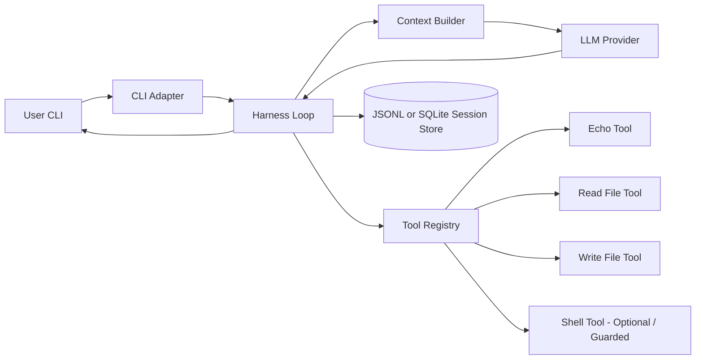

# Idea File: Bare-Bones Local LLM Harness MVP

## Goal

Build a minimal LLM harness from scratch.

The MVP should be a small, understandable system that can:

1. Accept a user message from the CLI.
2. Maintain a simple session history.
3. Build a prompt from a system prompt, prior messages, and the latest user message.
4. Call an LLM provider.
5. Detect and execute tool calls.
6. Return the final assistant response.
7. Persist turns and tool calls to local storage.
8. Allow tools to be added modularly.

This should not be a full agent platform yet. It should be a clear, testable foundation.

The first implementation should favor simplicity over abstraction, but it should avoid hard-coding tools directly into the LLM loop.

---

## Architectural Reference

This MVP borrows one important architectural lesson from OpenClaw-style agent systems: keep interface/input handling, the agent runtime loop, tool execution, and persisted session state as distinct concepts, even if they all live in one process for now.

For this MVP, that does **not** mean building a gateway, plugin system, mobile app, web UI, scheduler, vector memory, or multi-agent runtime. It only means keeping clean internal seams so the harness can evolve later.

---

## Non-Goals for MVP

Do not build these yet:

- Web UI
- Telegram integration
- Multi-agent routing
- Vector memory
- Background jobs
- Cron scheduling
- Browser automation
- Docker sandboxing
- Complex approval flows
- Remote gateway
- Plugin hot-loading
- Streaming UI
- OAuth
- Multi-user support

These may come later. The first version should run locally from the command line.

---

## Target Architecture

The MVP is a single-process local harness.



The important boundary is:

```text
User input -> normalized message -> session state -> context -> model -> tool calls -> tool results -> model/final answer -> persisted event log
```

---

## Recommended Language

Use Python for the first implementation.

Reasons:

- Fast iteration.
- Easy CLI.
- Easy unit testing with pytest.
- Simple function-based tools.
- Works well with local files and subprocesses.
- Easy later integration with llama.cpp, OpenAI, Anthropic, or local HTTP servers.

---

## Suggested Repo Structure

```text
llm_harness/
  README.md
  pyproject.toml
  config.example.yaml

  harness/
    __init__.py
    main.py
    cli.py
    loop.py
    messages.py       # core dataclasses: Message, ToolCall, ToolResult, AssistantTurn, ToolDefinition
    context.py
    sessions.py
    events.py         # SessionEvent dataclass and event_type literals
    config.py

  providers/
    __init__.py
    base.py
    fake_provider.py
    openai_compat_provider.py

  tools/
    __init__.py
    base.py
    registry.py
    echo_tool.py
    file_tools.py
    shell_tool.py

  storage/
    __init__.py
    jsonl_store.py

  tests/
    test_messages.py
    test_context.py
    test_sessions.py
    test_jsonl_store.py
    test_tool_registry.py
    test_echo_tool.py
    test_file_tools.py
    test_fake_provider.py
    test_loop.py
```

Use `pytest`.

Use a fake model provider for almost all unit tests. Do not require real API calls for tests.

---

## Core Data Model

### Message

Create a small normalized message object.

```python
@dataclass
class Message:
    role: Literal["system", "user", "assistant", "tool"]
    content: str
    name: str | None = None
    tool_call_id: str | None = None
```

### ToolCall

```python
@dataclass
class ToolCall:
    id: str
    name: str
    arguments: dict[str, Any]
```

### ToolResult

```python
@dataclass
class ToolResult:
    tool_call_id: str
    name: str
    content: str
    ok: bool
    error: str | None = None
```

### ToolDefinition

```python
@dataclass
class ToolDefinition:
    name: str
    description: str
    parameters: dict[str, Any]
```

### AssistantTurn

The model provider should return either a final response, tool calls, or both.

```python
@dataclass
class AssistantTurn:
    content: str | None
    tool_calls: list[ToolCall]
```

### SessionEvent

Persist events, not just final messages.

```python
@dataclass
class SessionEvent:
    session_id: str
    event_type: Literal[
        "user_message",
        "assistant_turn",   # captures content + tool_calls together as one atomic unit
        "tool_result",
        "error"
    ]
    payload: dict[str, Any]
    created_at: str
```

For MVP, JSONL is enough.

---

## Storage

Start with JSONL.

Each session can be stored as:

```text
data/sessions/default.jsonl
```

Each line is a JSON event.

Example:

```json
{"session_id":"default","event_type":"user_message","payload":{"content":"hello"},"created_at":"2026-06-22T10:00:00Z"}
{"session_id":"default","event_type":"assistant_turn","payload":{"content":"hi","tool_calls":[]},"created_at":"2026-06-22T10:00:01Z"}
```

Do not use a database yet unless JSONL becomes painful.

---

## Config

Use a simple YAML file.

Example:

```yaml
default_session_id: default

provider:
  type: openai_compat
  base_url: http://localhost:8080/v1
  model: local

system_prompt: |
  You are a local development assistant.
  Be concise.
  Use tools only when necessary.

tools:
  echo:
    enabled: true
  read_file:
    enabled: true
    root: ./workspace
  write_file:
    enabled: true
    root: ./workspace
  shell:
    enabled: false
    root: ./workspace
```

The shell tool should be disabled by default.

---

## Component 1: CLI Adapter

### Responsibility

Accept user input from the command line and pass it to the harness loop.

For MVP, support:

```bash
python -m harness.main "hello"
```

Optional interactive mode:

```bash
python -m harness.main --chat
```

### Unit Tests

Create `tests/test_cli.py` only if CLI parsing becomes non-trivial.

Minimum test expectations:

1. Parses a single prompt string.
2. Uses default session ID if none is provided.
3. Allows custom session ID with `--session`.

Avoid testing terminal interactivity heavily in MVP.

---

## Component 2: Session Store

### Responsibility

Persist and load session events.

Implement:

```python
class JsonlSessionStore:
    def append_event(self, event: SessionEvent) -> None:
        ...

    def load_events(self, session_id: str) -> list[SessionEvent]:
        ...
```

### Unit Tests

File: `tests/test_jsonl_store.py`

Test cases:

1. Appending one event creates the session file.
2. Loading an empty session returns an empty list.
3. Appending multiple events preserves order.
4. Events from different sessions go into different files.
5. Invalid/corrupt JSONL line raises a clear error or is skipped with a warning. Pick one behavior and document it.
6. Store creates parent directories if needed.

Use pytest `tmp_path`.

---

## Component 3: Session Manager

### Responsibility

Convert raw stored events into message history.

Implement:

```python
class SessionManager:
    def get_messages(self, session_id: str) -> list[Message]:
        ...

    def record_user_message(self, session_id: str, content: str) -> None:
        ...

    def record_assistant_turn(self, session_id: str, turn: AssistantTurn) -> None:
        # stores content and tool_calls together as one "assistant_turn" event
        ...

    def record_tool_result(self, session_id: str, result: ToolResult) -> None:
        ...
```

### Unit Tests

File: `tests/test_sessions.py`

Test cases:

1. User events become `role="user"` messages.
2. Assistant turn events with only content become a single `role="assistant"` message.
3. Assistant turn events with tool calls produce an assistant message that includes the tool calls.
4. Assistant turn events with both content and tool calls are stored and reconstructed atomically.
5. Tool result events become `role="tool"` messages.
6. Messages are returned in chronological order.
7. Unknown event types are ignored or raise a clear error. Pick one behavior and document it.

---

## Component 4: Context Builder

### Responsibility

Build the list of messages sent to the model.

For MVP:

```text
system prompt
+ prior session messages
+ latest user message
```

Implement:

```python
class ContextBuilder:
    def build(
        self,
        system_prompt: str,
        history: list[Message],
        latest_user_message: str,
    ) -> list[Message]:
        ...
```

Avoid summarization or memory search for now.

### Unit Tests

File: `tests/test_context.py`

Test cases:

1. First message is always the system prompt.
2. Latest user message is appended after history.
3. Existing history order is preserved.
4. Empty history works.
5. Empty system prompt is allowed or rejected. Pick one behavior and document it.
6. Context builder does not mutate the input history list.

---

## Component 5: Model Provider Interface

### Responsibility

Hide provider-specific API details from the harness loop.

Base interface:

```python
class ModelProvider(Protocol):
    def complete(
        self,
        messages: list[Message],
        tools: list[ToolDefinition],
    ) -> AssistantTurn:
        ...
```

Implement a fake provider first.

The fake provider should allow tests to pre-program responses.

Example:

```python
fake = FakeProvider([
    AssistantTurn(content=None, tool_calls=[ToolCall(...)]),
    AssistantTurn(content="Done", tool_calls=[]),
])
```

### Unit Tests

File: `tests/test_fake_provider.py`

Test cases:

1. Returns programmed responses in order.
2. Raises a clear error when no responses remain.
3. Records messages passed to it for inspection.
4. Records tool definitions passed to it.

Real provider tests should be optional/integration tests only.

Do not require API keys for unit tests.

---

## Component 6: Tool Base Interface

### Responsibility

Define the shape every tool must implement.

```python
@dataclass
class ToolDefinition:
    name: str
    description: str
    parameters: dict[str, Any]

class Tool(Protocol):
    name: str

    def definition(self) -> ToolDefinition:
        ...

    def run(self, arguments: dict[str, Any], context: ToolContext) -> ToolResult:
        ...
```

ToolContext should include:

```python
@dataclass
class ToolContext:
    session_id: str
    workspace_root: Path
```

---

## Component 7: Tool Registry

### Responsibility

Register tools and execute tool calls by name.

```python
class ToolRegistry:
    def register(self, tool: Tool) -> None:
        ...

    def definitions(self) -> list[ToolDefinition]:
        ...

    def run(self, call: ToolCall, context: ToolContext) -> ToolResult:
        ...
```

### Unit Tests

File: `tests/test_tool_registry.py`

Test cases:

1. Registering a tool makes its definition available.
2. Running a registered tool calls the correct tool.
3. Running an unknown tool returns a failed ToolResult or raises a clear error. Prefer failed ToolResult for harness robustness.
4. Duplicate tool names raise an error.
5. Tool exceptions are caught and converted to failed ToolResult.
6. Tool call ID is preserved in the result.

---

## Component 8: Echo Tool

### Responsibility

Simple safe tool for testing.

Input:

```json
{"text": "hello"}
```

Output:

```text
hello
```

### Unit Tests

File: `tests/test_echo_tool.py`

Test cases:

1. Returns the input text.
2. Missing `text` returns a failed result.
3. Non-string `text` returns a failed result.
4. Tool definition includes name, description, and JSON schema.

---

## Component 9: File Tools

Implement two tools:

1. `read_file`
2. `write_file`

Both should be restricted to a configured workspace root.

### read_file

Input:

```json
{"path": "notes/todo.md"}
```

Behavior:

- Resolve path under workspace root.
- Reject paths outside the workspace.
- Return file content as text.

### write_file

Input:

```json
{"path": "notes/todo.md", "content": "hello"}
```

Behavior:

- Resolve path under workspace root.
- Reject paths outside the workspace.
- Create parent directories if needed.
- Write text content.

### Unit Tests

File: `tests/test_file_tools.py`

Test cases:

1. `read_file` reads an existing file.
2. `read_file` fails clearly on missing file.
3. `read_file` rejects `../secret.txt`.
4. `read_file` rejects absolute paths outside workspace.
5. `write_file` writes a new file.
6. `write_file` creates parent directories.
7. `write_file` rejects path traversal.
8. `write_file` rejects missing content.
9. `write_file` rejects non-string content.
10. Both tools preserve tool call ID in results.

Path safety matters even in the MVP.

---

## Component 10: Shell Tool

The shell tool is optional for the first commit.

If implemented, it must be disabled by default.

Input:

```json
{"argv": ["ls", "-la"]}
```

`argv` matches Python's `subprocess` naming and avoids any ambiguity with shell string parsing. Do not accept a plain `command` string — always require a list.

MVP behavior:

- Run command with `subprocess.run(argv, ...)`.
- Do not use `shell=True`.
- Use workspace root as current working directory.
- Timeout after a small number of seconds.
- Capture stdout and stderr.
- Return exit code, stdout, and stderr.

### Unit Tests

File: `tests/test_shell_tool.py`

Test cases:

1. Runs a simple allowed command.
2. Uses workspace root as cwd.
3. Captures stdout.
4. Captures stderr.
5. Returns non-zero exit codes as failed or ok-with-exit-code. Pick one behavior and document it.
6. Times out long-running commands.
7. Rejects empty argv.
8. Rejects non-list argv.
9. Rejects shell metacharacter string mode if string commands are not supported.

---

## Component 11: Harness Loop

### Responsibility

Coordinate one full user turn.

Pseudo-flow:

```python
def run_turn(session_id: str, user_text: str) -> str:
    history = session.get_messages(session_id)
    messages = context_builder.build(system_prompt, history, user_text)
    session.record_user_message(session_id, user_text)

    while True:
        assistant_turn = provider.complete(messages, tool_registry.definitions())

        # persist content + tool_calls together as one atomic event
        session.record_assistant_turn(session_id, assistant_turn)
        # append the full turn so the provider sees tool_calls in context
        messages.append(assistant_turn_to_message(assistant_turn))

        if not assistant_turn.tool_calls:
            return assistant_turn.content or ""

        for call in assistant_turn.tool_calls:
            result = tool_registry.run(call, tool_context)
            session.record_tool_result(session_id, result)
            messages.append(tool_result_to_message(result))

        if max_tool_rounds exceeded:
            record error and return a clear failure message
```

Important: avoid duplicating the latest user message. Build the model context from existing history plus the latest user message, then persist the latest user message.

`assistant_turn_to_message` must include both `content` and `tool_calls` in the returned message so that tool result messages that follow are correctly anchored to the turn that requested them.

### Max Tool Rounds

Add a `max_tool_rounds` setting, default 5.

This prevents infinite tool loops.

### Unit Tests

File: `tests/test_loop.py`

Use fake provider and fake tools.

Test cases:

1. Simple user message produces assistant response.
2. User message is persisted.
3. Assistant response is persisted.
4. Tool call is executed.
5. Tool result is added back into model messages.
6. Final assistant response after tool call is returned.
7. Assistant turn (content + tool calls) and tool result are persisted as separate events.
8. Unknown tool produces a failed tool result and lets the model continue.
9. Tool exception is captured and does not crash the loop.
10. Max tool rounds stops infinite loops.
11. Context includes prior session history.
12. Tool definitions are passed to provider.
13. No real provider/API is needed for loop tests.

---

## Component 12: OpenAI-Compatible Provider

Implement only after fake provider and harness loop work.

This provider targets the OpenAI HTTP API wire format, which is also exposed by `llama-server` (llama.cpp's built-in HTTP server) on `localhost`. The same provider code works for both a local llama.cpp model and the real OpenAI API — only `base_url` and `model` differ in config.

The provider should:

- Convert internal `Message` objects into OpenAI-compatible messages (including tool call fields).
- Convert internal `ToolDefinition` objects into the OpenAI tool schema format.
- Convert provider response into `AssistantTurn`, preserving both `content` and `tool_calls`.
- Hide all wire-format details from the harness loop.

### Unit Tests

File: `tests/test_openai_compat_provider.py`

Keep these mostly pure conversion tests.

Test cases:

1. Converts system/user/assistant/tool messages correctly.
2. Converts assistant message with tool calls correctly (both fields present).
3. Converts tool definitions correctly.
4. Converts final assistant response into `AssistantTurn` with empty tool_calls.
5. Converts tool-call response into `AssistantTurn` with populated tool_calls.
6. Does not make real HTTP calls in unit tests.

Use mocks for the HTTP client.

Real provider tests can be marked:

```python
@pytest.mark.integration
```

and skipped by default.

---

## Error Handling Principles

The harness should not crash during normal tool/model failures.

Prefer:

- Return failed `ToolResult` for tool errors.
- Record error events for unexpected failures.
- Raise during startup/config errors.
- Raise during programmer errors in tests.

Examples of startup/config errors:

- Missing config file.
- Unknown provider type.
- Invalid workspace path.
- Duplicate tool names.

Examples of runtime recoverable errors:

- Tool not found.
- Tool arguments invalid.
- Tool execution failed.
- File missing.
- Shell command timeout.

---

## First Milestone

Build the smallest end-to-end system:

```bash
python -m harness.main "Say hello"
```

Expected behavior:

1. Loads config.
2. Creates default session.
3. Sends message to fake provider or real provider.
4. Prints assistant response.
5. Writes JSONL session event log.

Tools may exist but do not need to be used yet.

---

## Second Milestone

Add fake tool call flow.

Using `FakeProvider`, test:

1. Model asks to call `echo`.
2. Harness executes `echo`.
3. Tool result is sent back to fake model.
4. Fake model returns final answer.
5. Final answer is printed.
6. Events are persisted.

No real LLM needed.

---

## Third Milestone

Add the OpenAI-compatible provider.

At this point the same harness loop should work with a real local model via llama.cpp's `llama-server`, or with the OpenAI API by changing `base_url` and `model` in config.

Example (local llama.cpp):

```bash
llama-server -m path/to/model.gguf --port 8080
python -m harness.main "Use the echo tool to repeat hello"
```

---

## Fourth Milestone

Add file tools.

Create a local workspace:

```text
workspace/
  notes/
```

Test:

```bash
python -m harness.main "Write a short todo list to notes/todo.md"
python -m harness.main "Read notes/todo.md"
```

---

## Fifth Milestone

Optionally add guarded shell tool.

Keep it disabled unless explicitly enabled in config.

---

## Testing Requirements

Use pytest.

Every core component should have unit tests.

Minimum required tests before calling MVP complete:

```text
tests/test_jsonl_store.py
tests/test_sessions.py
tests/test_context.py
tests/test_tool_registry.py
tests/test_echo_tool.py
tests/test_file_tools.py
tests/test_fake_provider.py
tests/test_openai_compat_provider.py
tests/test_loop.py
```

Target:

- No network required.
- No API key required.
- No tests depend on test order.
- Use `tmp_path` for filesystem tests.
- Use fake provider for loop tests.
- Use fake tools where needed.
- Keep tests small and readable.

Run:

```bash
pytest
```

Optional coverage:

```bash
pytest --cov=harness --cov=tools --cov=storage --cov=providers
```

---

## MVP Acceptance Criteria

The MVP is done when:

1. A user can send one CLI prompt and receive one assistant response.
2. Session events are persisted locally.
3. The harness can execute at least one tool through a registry.
4. The harness can complete a model -> tool -> model loop.
5. File tools are restricted to the workspace root.
6. Unit tests cover each major component.
7. A fake provider can test the full loop without network access.
8. A real provider can be enabled by config.
9. The shell tool is either absent or disabled by default.
10. The code is understandable enough that a human can trace one full turn in under five minutes.

---

## Design Bias

Prefer boring code.

Prefer explicit data structures.

Prefer one clear loop over premature framework abstractions.

Do not build a plugin system yet. A simple registry is enough.

Do not build memory yet. Session history is enough.

Do not build a gateway yet. CLI is enough.

But keep these concepts separate in code:

- channel/input adapter
- session storage
- context construction
- model provider
- tool registry
- tool execution
- event persistence

That separation is what will let this small harness grow later.
